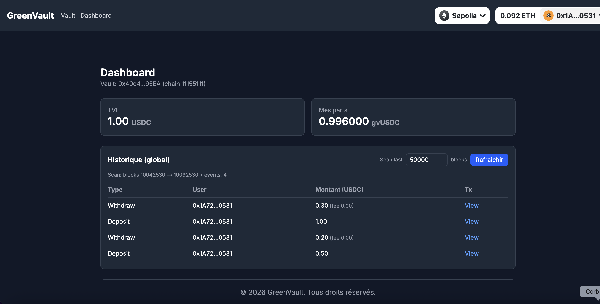
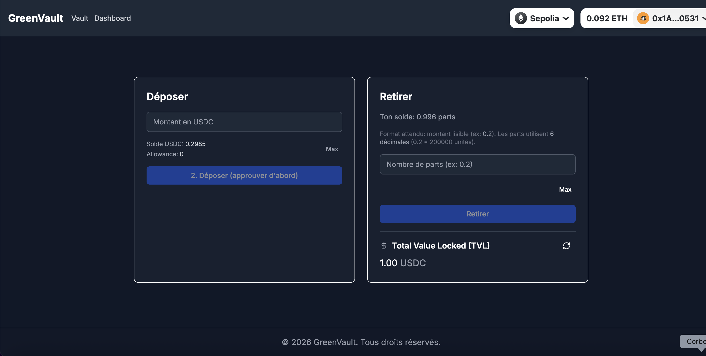

# 🌱🏦 GreenVault (MVP)

Vault DeFi **simple et fiable** (MVP) permettant de déposer des **USDC (Sepolia)** et de recevoir des parts tokenisées (**gvUSDC**) en échange, avec un **dashboard** (TVL, position, historique on-chain).

**Réseau cible (MVP)**: Sepolia Testnet


---

## 📋 Fonctionnalités

- ✅ **Deposit USDC** → mint de parts **gvUSDC** (ratio 1:1 sur le MVP)
- ✅ **Withdraw** → burn de parts et retour d’USDC (**fee 0.5%**)
- ✅ **Dashboard** (`/dashboard`): TVL, parts, historique global + “mon activité”
- ✅ **Indexation légère** via API Next.js: lecture des events `Deposited/Withdrawn` (scan “last N blocks”)
- ✅ **Wallet connect** via RainbowKit
- ✅ **Sécurité MVP**: `ReentrancyGuard`, `Ownable`, `Pausable` (pause/unpause)

---

## 🖼️ Screenshots

> Place tes images dans `docs/screenshots/` (voir `docs/screenshots/ADD_SCREENSHOTS_HERE.md`).

Dashboard:



Vault:



---

## 🏗️ Architecture (résumé)

```
backend/
  contracts/
    EverVault_MVP.sol         # MVP: GreenVaultSimple (USDC-only)
    EverVault.sol             # Version complète (Aave) - non utilisée en MVP
    mocks/MockUSDC.sol        # Mock 6 decimals (tests)
  scripts/
    deploy_MVP.ts             # Déploiement MVP (Sepolia)
  test/GreenVaultSimple.test.ts

frontend/
  app/
    page.tsx                  # Vault (deposit/withdraw)
    dashboard/page.tsx        # Dashboard
    api/vault-events/route.ts # API logs Deposited/Withdrawn
  components/
```

---

## 🚀 Installation & run

### Backend

```bash
cd backend
npm install
npm test
```

### Frontend

```bash
cd frontend
npm install
npm run dev
```

---

## ⚙️ Configuration

### Backend (Sepolia)

```env
SEPOLIA_PRIVATE_KEY=0x...
```

### Frontend

Copie `frontend/env.example` → `frontend/.env.local` puis remplis:

```env
NEXT_PUBLIC_VAULT_ADDRESS_SEPOLIA=0x...
NEXT_PUBLIC_WALLETCONNECT_PROJECT_ID=...
NEXT_PUBLIC_SEPOLIA_RPC_URL=...
```

---

## 📦 Déploiement (Sepolia)

```bash
cd backend
npm run deploy:mvp:sepolia
```

Puis mets l’adresse affichée dans le front (`NEXT_PUBLIC_VAULT_ADDRESS_SEPOLIA`).

---

## 🎯 Comment ça marche ?

- **Deposit**: approve USDC → `deposit(usdcAmount)` → mint shares (1:1 en MVP)
- **Withdraw**: `withdraw(shares)` → burn shares → retour USDC **net** (fee 0.5%)
- **Dashboard**: le front lit `totalValueLocked` + `balanceOf` et charge les events via `/api/vault-events`

---

## 🔐 Security notes / assumptions (MVP)

- **Non-audité**: ce projet est un MVP portfolio (pas prêt pour mainnet / fonds réels).
- **Trust / admin**: `owner` peut `pause()`/`unpause()` et changer `feeRecipient`.
- **Shares 1:1**: le MVP mint/burn des parts **1:1** avec l’USDC déposé (pas de stratégie, pas de yield, pas de “pricePerShare” dynamique).
- **Décimales**: l’UI et le contrat supposent **6 décimales** (USDC / shares).
- **Protection reentrancy**: `deposit()` et `withdraw()` utilisent `ReentrancyGuard`.
- **Disponibilité des fonds**: le retrait suppose que le contrat détient assez d’USDC (pas de stratégie externe en MVP).

---

## 🔮 Évolutions futures (V2)

- [ ] Architecture **Vault + Strategy**, puis Aave (sur réseau supporté / fork)
- [ ] **Multi-vaults** (factory + 1 vault par asset)
- [ ] Projets énergie: **RECs registry**, **grid flex market**, **energy DAO**

---

## 📄 Licence

MIT License - Voir [LICENSE](LICENSE)
